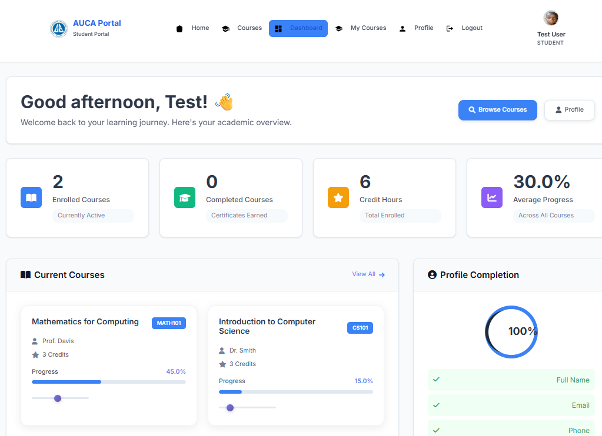
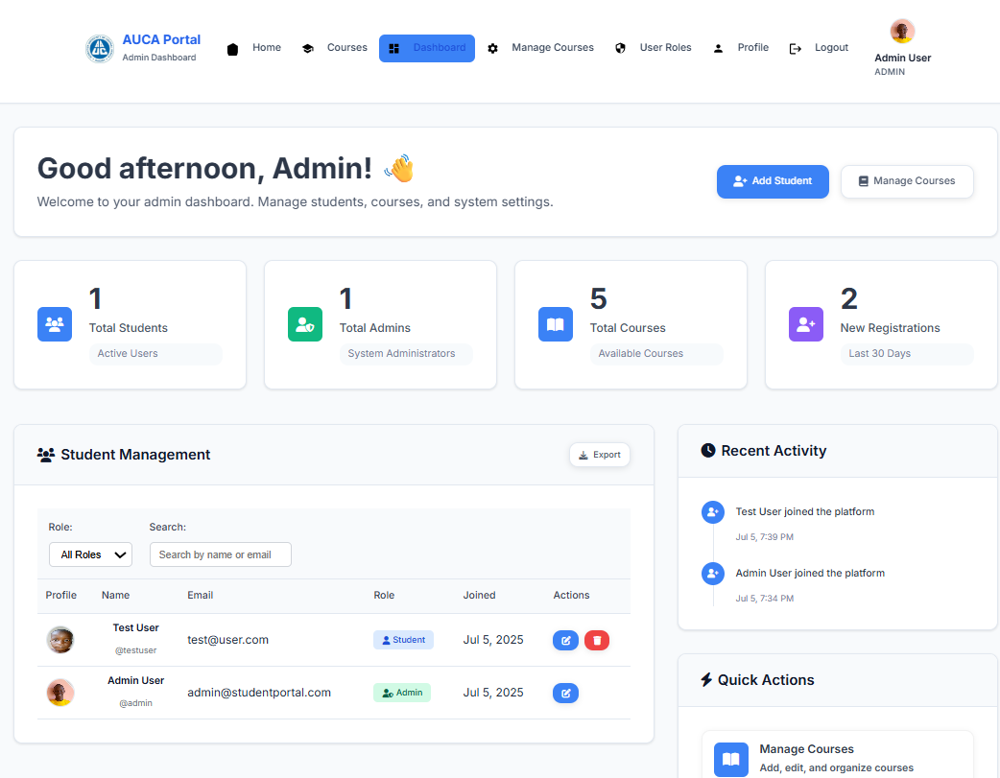
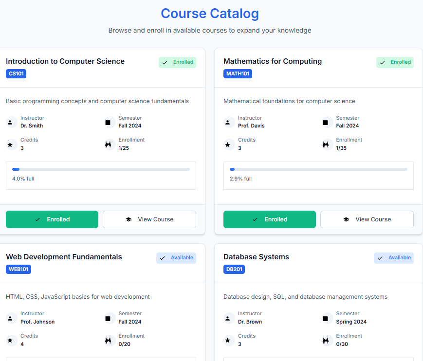

# AUCA Student Portal 🎓

A comprehensive web-based student portal system for the Adventist University of Central Africa (AUCA), built with PHP and MySQL. This modern, responsive platform provides students and administrators with powerful tools for academic management and course administration.


## 📋 Table of Contents

- [Features](#features)
- [Screenshots](#screenshots)
- [Requirements](#requirements)
- [Installation](#installation)
- [Database Setup](#database-setup)
- [Configuration](#configuration)
- [Usage](#usage)
- [User Roles](#user-roles)
- [API Endpoints](#api-endpoints)
- [Contributing](#contributing)
- [License](#license)
- [Support](#support)

## ✨ Features

### 🎯 Core Features
- **Modern Authentication System** - Secure login/signup with password hashing
- **Role-Based Access Control** - Separate interfaces for students and administrators
- **Responsive Design** - Works seamlessly on desktop, tablet, and mobile devices
- **Password Reset** - Email-based password recovery system
- **Profile Management** - Upload profile pictures and manage personal information
- **Activity Logging** - Track user actions and system events

### 👨‍🎓 Student Features
- **Personal Dashboard** - Overview of academic progress and statistics
- **Course Catalog** - Browse and search available courses
- **Course Enrollment** - Easy enrollment and course management
- **Progress Tracking** - Monitor academic achievements and completion rates
- **Profile Customization** - Update personal information and profile pictures

### 👨‍💼 Admin Features
- **Admin Dashboard** - Comprehensive system overview and statistics
- **Student Management** - Create, edit, and manage student accounts
- **Course Administration** - Add, edit, and organize courses
- **User Role Management** - Assign and modify user permissions
- **System Analytics** - View enrollment statistics and user activity
- **Data Export** - Export student and course data (coming soon)

### 🎨 UI/UX Features
- **Clean, Modern Interface** - Intuitive navigation and user experience
- **Dark/Light Theme Support** - Customizable interface themes
- **Interactive Elements** - Smooth animations and hover effects
- **Font Awesome Icons** - Professional iconography throughout
- **Responsive Grid Layouts** - Optimized for all screen sizes

## 📱 Screenshots

### Student Dashboard


### Admin Dashboard


### Course Catalog


## 🔧 Requirements

- **PHP**: 7.4 or higher (8.0+ recommended)
- **MySQL**: 5.7 or higher (8.0+ recommended)
- **Web Server**: Apache or Nginx
- **Extensions**: 
  - PDO MySQL
  - GD (for image processing)
  - OpenSSL
  - Mbstring
  - Fileinfo

## 📦 Installation

### 1. Clone the Repository
```bash
git clone https://github.com/nshuti7/auca-student-portal.git
cd auca-student-portal
```

### 2. Set Up Web Server
- **XAMPP/LAMP**: Place the project folder in your web server's document root
- **Apache**: Point virtual host to the project directory
- **Nginx**: Configure server block for the project

### 3. Configure Permissions
```bash
# Make sure uploads directory is writable
chmod 755 assets/images/profiles/
chmod 755 logs/

# For Linux/Unix systems
sudo chown -R www-data:www-data assets/images/profiles/
sudo chown -R www-data:www-data logs/
```

## 🗄️ Database Setup

### 1. Create Database
```sql
CREATE DATABASE student_portal;
USE student_portal;
```

### 2. Import Database Schema
```bash
mysql -u root -p student_portal < database_setup.sql
```

### 3. Configure Database Connection
Edit `includes/db.php` with your database credentials:
```php
$host    = 'localhost';
$db_name = 'student_portal';
$db_user = 'your_username';
$db_pass = 'your_password';
```

### 4. Create Admin User
```sql
INSERT INTO students (full_name, email, username, password_hash, role) 
VALUES ('Admin User', 'admin@auca.edu', 'admin', 
        '$2y$10$92IXUNpkjO0rOQ5byMi.Ye4oKoEa3Ro9llC/.og/at2.uheWG/igi', 'admin');
```
*Default admin password: `password` (change immediately after first login)*

## ⚙️ Configuration

### Email Settings
For password reset functionality, configure email settings in `send_reset_email.php`:
```php
// Configure your SMTP settings
$smtp_host = 'your-smtp-server.com';
$smtp_port = 587;
$smtp_user = 'your-email@domain.com';
$smtp_pass = 'your-email-password';
```

### File Upload Settings
Adjust file upload limits in `upload_profile_picture.php`:
```php
$max_file_size = 5 * 1024 * 1024; // 5MB
$allowed_types = ['image/jpeg', 'image/png', 'image/gif'];
```

## 🚀 Usage

### For Students
1. **Registration**: Create an account using the signup form
2. **Login**: Access your dashboard with username/email and password
3. **Browse Courses**: Explore available courses in the catalog
4. **Enroll**: Click "Enroll Now" on desired courses
5. **Track Progress**: Monitor your academic progress on the dashboard
6. **Manage Profile**: Update personal information and profile picture

### For Administrators
1. **Admin Login**: Use admin credentials to access admin dashboard
2. **Student Management**: Add, edit, or remove student accounts
3. **Course Management**: Create and manage course offerings
4. **User Roles**: Assign administrative privileges to users
5. **System Monitoring**: View statistics and user activity

## 👥 User Roles

### Student Role
- Access personal dashboard
- View and enroll in courses
- Manage personal profile
- Upload profile pictures
- Reset password
- View academic progress

### Admin Role
- All student permissions
- Access admin dashboard
- Manage student accounts
- Create and edit courses
- Manage user roles
- View system statistics
- Export data (coming soon)

## 🔗 API Endpoints

### Authentication
- `POST /login_process.php` - User login
- `POST /signup_process.php` - User registration
- `POST /process_reset.php` - Password reset

### Courses
- `GET /courses.php` - Course catalog
- `POST /enroll_course.php` - Enroll in course
- `POST /drop_course.php` - Drop course
- `GET /get_course_details.php` - Course details

### Profile
- `POST /update_process.php` - Update profile
- `POST /upload_profile_picture.php` - Upload profile picture

## 🤝 Contributing

We welcome contributions! Please follow these guidelines:

1. **Fork the repository**
2. **Create a feature branch**: `git checkout -b feature/amazing-feature`
3. **Commit your changes**: `git commit -m 'Add amazing feature'`
4. **Push to the branch**: `git push origin feature/amazing-feature`
5. **Open a Pull Request**

### Development Guidelines
- Follow PSR-12 coding standards
- Write meaningful commit messages
- Add comments for complex logic
- Test your changes thoroughly
- Update documentation if needed

## 📝 License

This project is licensed under the MIT License - see the [LICENSE](LICENSE) file for details.

## 📞 Support

### Getting Help
- **Documentation**: Check this README and inline comments
- **Issues**: Open an issue on GitHub for bugs or feature requests
- **Email**: Contact the development team at dev@auca.edu

### Common Issues
- **Database Connection**: Check credentials in `includes/db.php`
- **File Uploads**: Verify directory permissions for `assets/images/profiles/`
- **Email Issues**: Configure SMTP settings for password reset functionality

## 🔮 Roadmap

### Upcoming Features
- [ ] Mobile app development
- [ ] Real-time notifications
- [ ] Advanced analytics dashboard
- [ ] Course discussion forums
- [ ] Assignment submission system
- [ ] Grade management
- [ ] Calendar integration
- [ ] Bulk data import/export

### Version History
- **v1.0.0** - Initial release with core features
- **v1.1.0** - Added admin dashboard and course management
- **v1.2.0** - Implemented responsive design and UI improvements
- **v1.3.0** - Added password reset and profile picture functionality

## 🏗️ Architecture

```
student_portal/
├── assets/
│   ├── css/         # Stylesheets
│   ├── js/          # JavaScript files
│   └── images/      # Static images and uploads
├── includes/
│   ├── db.php       # Database connection
│   ├── navigation.php # Navigation component
│   └── activity_logger.php # Activity logging
├── logs/            # Application logs
├── *.php            # Main application files
└── database_setup.sql # Database schema
```

## 🌟 Acknowledgments

- **Adventist University of Central Africa** - For the educational mission
- **Font Awesome** - For the beautiful icons
- **Google Fonts** - For the typography
- **PHP Community** - For the robust language and frameworks

---

**Built with ❤️ for education at AUCA**

For more information, visit our [website](https://auca.edu) or contact us at [info@auca.edu](mailto:info@auca.edu). 